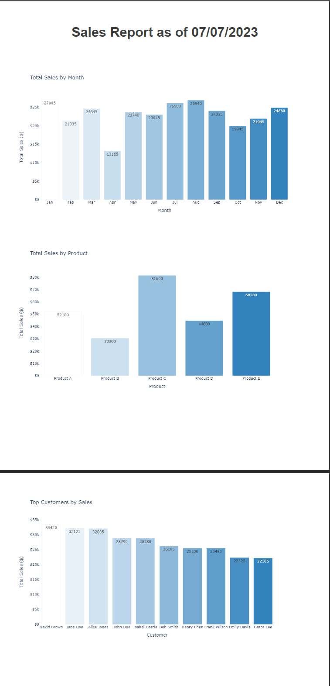

# Sales Data Analysis and PDF Report Generation 📊

## Overview
This project focuses on analyzing sales data and generating visually appealing PDF reports using Python and SQL. The goal is to provide insightful information and present it in a professional and attractive manner through visualizations and summarized data.

## Database Schema


## PDF Output Sales Report


## Features
* Extract and analyze sales data from various sources using SQL queries.
* Perform data preprocessing and cleansing to ensure accuracy and reliability.
* Utilize Python libraries, such as Pandas, Matplotlib, and Plotly, for data manipulation and visualization.
* Generate interactive and visually appealing bar graphs, line charts, and pie charts to represent sales data.
* Transform the sales analysis into a PDF report for easy sharing and presentation.

## Author
- <ins><b>©2023 Tushar Aggarwal. All rights reserved</b></ins>
- <b>[LinkedIn](https://www.linkedin.com/in/tusharaggarwalinseec/)</b>
- <b>[Medium](https://medium.com/@tushar_aggarwal)</b> 
- <b>[Tushar-Aggarwal.com](https://www.tushar-aggarwal.com/)</b>
- <b>[Kaggle](https://www.kaggle.com/tusharaggarwal27)</b> 


## Feedback
```The Sales Data Analysis and PDF Report Generation project combines the power of Python, SQL, and data visualization libraries to extract, analyze, and present sales data in an attractive and informative way. By following the outlined steps and utilizing the provided code examples, you can generate insightful reports that will assist in decision-making and communicate key sales information effectively```

Got some thoughts or suggestions? Don't hesitate to reach out to me at info@tushar-aggarwal.com. I'd love to hear from you! 💡
